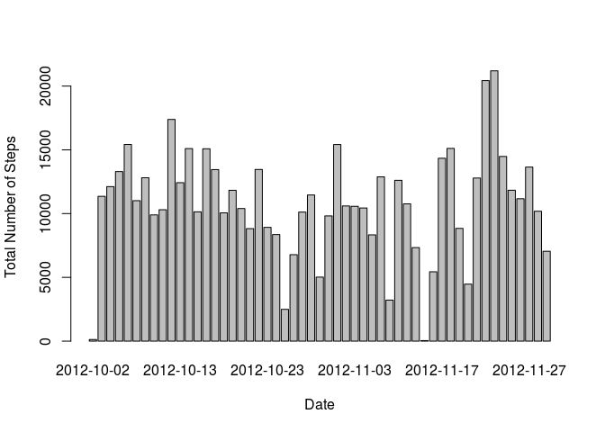
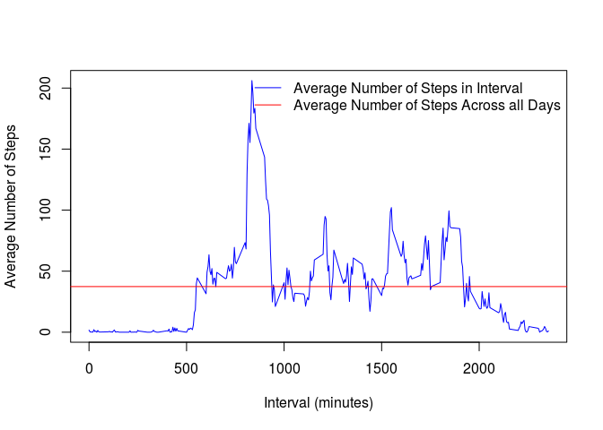
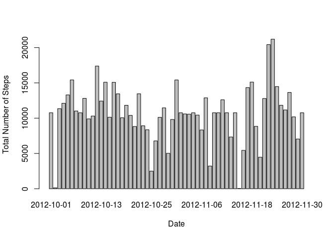
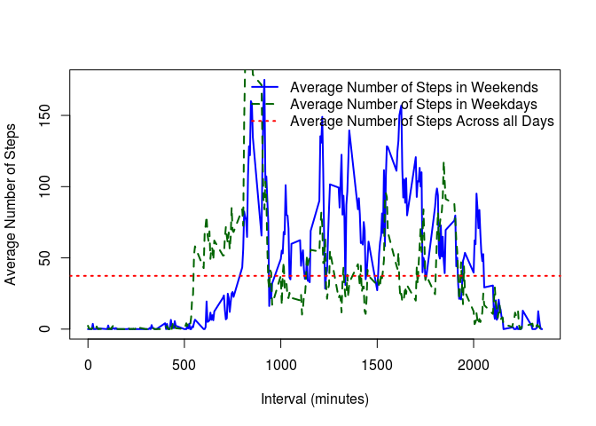

# Reproducible Research: Peer Assessment 1


## Loading and preprocessing the data

```r
# Load the data (i.e. read.csv())

file <- read.csv("activity.csv")

# Process/transform the data (if necessary) into a format suitable for your analysis
summary(file)
```

```
##      steps               date          interval   
##  Min.   :  0.0   2012-10-01:  288   Min.   :   0  
##  1st Qu.:  0.0   2012-10-02:  288   1st Qu.: 589  
##  Median :  0.0   2012-10-03:  288   Median :1178  
##  Mean   : 37.4   2012-10-04:  288   Mean   :1178  
##  3rd Qu.: 12.0   2012-10-05:  288   3rd Qu.:1766  
##  Max.   :806.0   2012-10-06:  288   Max.   :2355  
##  NA's   :2304    (Other)   :15840
```

```r
names(file)
```

```
## [1] "steps"    "date"     "interval"
```

## What is mean total number of steps taken per day?

```r
# Make a histogram of the total number of steps taken each day
barplot(names=aggregate(steps ~ date,data=file,sum)[,1],aggregate(steps ~ date,data=file,sum)[,2], xlab="Date", ylab="Total Number of Steps")
```

 

```r
# Calculate and report the mean and median total number of steps taken per day
mean(aggregate(steps ~ date,data=file,mean)[,2])
```

```
## [1] 37.38
```

```r
median(aggregate(steps ~ date,data=file,mean)[,2])
```

```
## [1] 37.38
```


## What is the average daily activity pattern?

```r
# Make a time series plot (i.e. type = "l") of the 5-minute interval (x-axis) and the average number of steps taken, averaged across all days (y-axis)
plot(aggregate(steps~interval,data=file,mean), type="l", xlab= "Interval (minutes)", ylab="Average Number of Steps", col="blue")
abline(mean(aggregate(steps ~ date,data=file,mean)[,2]),0, col="red")
legend("topright", bty="n", legend=c("Average Number of Steps in Interval","Average Number of Steps Across all Days"),lty=c(1,1),col=c("blue","red"))
```

 

```r
# Which 5-minute interval, on average across all the days in the dataset, contains the maximum number of steps?
mSteps<-aggregate(steps~interval,data=file,mean)
maxSteps <- mSteps[mSteps[,2]>=max(mSteps[,2]),1]
maxSteps
```

```
## [1] 835
```

## Imputing missing values

```r
# Calculate and report the total number of missing values in the dataset (i.e. the total number of rows with NAs)

# Total NAs
sum(is.na(file))
```

```
## [1] 2304
```

```r
# Check total number of rows with NAs
sum(!complete.cases(file))
```

```
## [1] 2304
```

```r
# Devise a strategy for filling in all of the missing values in the dataset. The strategy does not need to be sophisticated. For example, you could use the mean/median for that day, or the mean for that 5-minute interval, etc.

# file[is.na(file)] <- median(file$steps,na.rm=TRUE)
# Strategy is to replace missing values with the mean


# Create a new dataset that is equal to the original dataset but with the missing data filled in.
file2 <- file
file2[is.na(file2)] <- mean(file2$steps,na.rm=TRUE)

# Make a histogram of the total number of steps taken each day and Calculate and report the mean and median total number of steps taken per day. Do these values differ from the estimates from the first part of the assignment? What is the impact of imputing missing data on the estimates of the total daily number of steps?

barplot(names=aggregate(steps ~ date,data=file2,sum)[,1],aggregate(steps ~ date,data=file2,sum)[,2], xlab="Date", ylab="Total Number of Steps")
```

 

```r
# Calculate and report the mean and median total number of steps taken per day
mean(aggregate(steps ~ date,data=file2,mean)[,2])
```

```
## [1] 37.38
```

```r
median(aggregate(steps ~ date,data=file2,mean)[,2])
```

```
## [1] 37.38
```

```r
# Do these values differ from the estimates from the first part of the assignment? What is the impact of imputing missing data on the estimates of the total daily number of steps?

# Difference in Means due to imputation
mean(aggregate(steps ~ date,data=file,mean)[,2]) - mean(aggregate(steps ~ date,data=file2,mean)[,2])
```

```
## [1] 0
```

```r
#Difference in Medians due to imputation
median(aggregate(steps ~ date,data=file,mean)[,2]) - median(aggregate(steps ~ date,data=file2,mean)[,2])
```

```
## [1] -0.004127
```

```r
# We did not make much of a difference by imputing NAs with the mean
```


## Are there differences in activity patterns between weekdays and weekends?


```r
# Create a new factor variable in the dataset with two levels – “weekday” and “weekend” indicating whether a given date is a weekday or weekend day.

file$week<-ifelse(weekdays(as.Date(file$date)) %in% c("Sunday","Saturday"), "weekend","weekday")


weekendD <- file[file$week=="weekend",]
weekdayD <- file[file$week=="weekday",]

plot(aggregate(steps~interval,data=weekendD,mean), type="l", xlab= "Interval (minutes)", ylab="Average Number of Steps", col="blue",lwd=2)
lines(aggregate(steps~interval,data=weekdayD,mean),col="darkgreen",lty=2,lwd=2)
abline(mean(aggregate(steps ~ date,data=file,mean)[,2]),0, col="red",lty=3,lwd=2)
legend("topright", bty="n", legend=c("Average Number of Steps in Weekends","Average Number of Steps in Weekdays","Average Number of Steps Across all Days"),lty=c(1,2,3),col=c("blue","darkgreen","red"),lwd=c(2,2,2))
```

 
